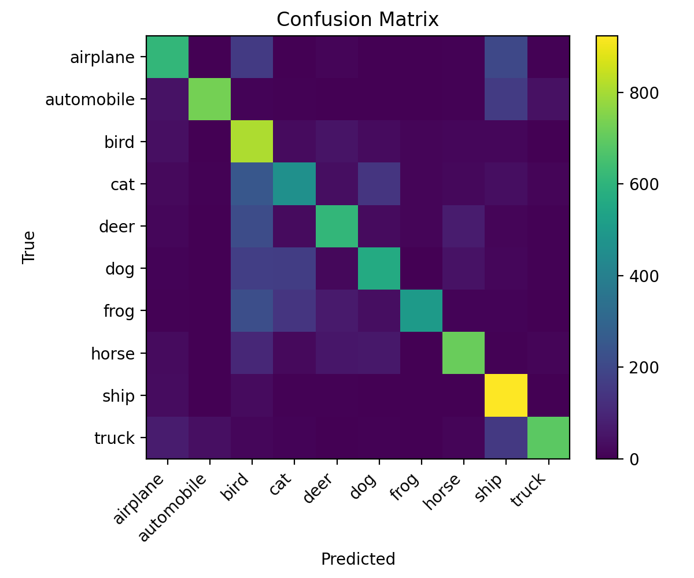
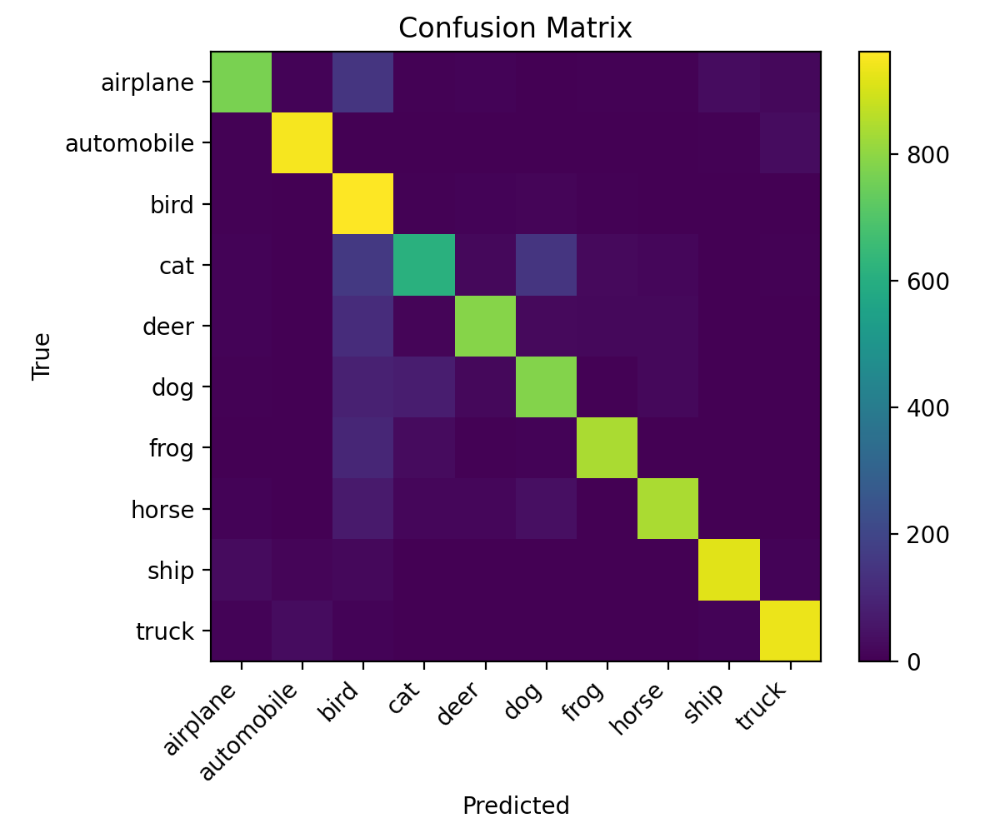

# Fine-tuning a Small Model for Challenging Test Images (CAP6415 F25)

**Student:** Cale Schad (z23503021)  
**Course:** CAP6415 — Fall 2025  
**Project:** Individual Project #8 — *Fine-tune a small model for challenging test images*  
**Repository:** https://github.com/cschad2019/CAP6415_F25_project-FineTune-Challenging-Images

---

## Abstract
We train a small CNN (< 50 layers; ResNet-18) on CIFAR-10 to obtain a **baseline**, identify the **lowest-precision (most challenging) class** from the confusion matrix, and then **fine-tune** using class-focused sampling and mild augmentations. We report before/after precision for the target class, overall accuracy, learning curves, and qualitative samples. The code is fully reproducible on **CPU** via `requirements.txt` and fixed seeds.

---

## Results (baseline vs. targeted fine-tune)

| Run        | Overall Acc | Worst Class | Precision (worst) |
|------------|-------------|-------------|-------------------|
| Baseline   | **0.761**   | **cat**     | **0.536**         |
| Fine-tuned | **0.841**   | **bird**    | **0.571**   
      
**Baseline**


**Fine-tune**



**Targeted improvement (cat):** 0.536 → **0.804** (**+0.268**).  
After improving **cat**, the error profile shifted and **bird** became the new weakest class (0.571), which is expected when you focus capacity on a prior failure mode.

**Artifacts (exact file names):**
- **Baseline:** `results/best.pt`, `results/baseline_confusion_matrix.png`, `results/samples_baseline/{correct_grid.png, wrong_grid.png}`
- **Fine-tune:** `results/best_finetune.pt`, `results/finetune_confusion_matrix.png`, `results/samples_finetune/{correct_grid.png, wrong_grid.png}`


---

## Quick Start (CPU, Windows / PowerShell)

```powershell
# 0) Clone and open in VS Code
git clone https://github.com/cschad2019/CAP6415_F25_project-FineTune-Challenging-Images
cd CAP6415_F25_project-FineTune-Challenging-Images

# 1) Create & activate a virtual environment
python -m venv .venv
.\.venv\Scripts\Activate.ps1

# If PowerShell blocks activation:
# Set-ExecutionPolicy -Scope Process -ExecutionPolicy Bypass
# .\.venv\Scripts\Activate.ps1

# 2) Install dependencies (CPU-only)
pip install -r requirements.txt
One-click run in VS Code
Open Run and Debug (Ctrl/Cmd+Shift+D).

Choose a configuration:

Baseline ▶ Train → Eval

Finetune ▶ Train → Eval

Press ▶ Run (Without Debugging).

Outputs are written to results/.

Alternative: Terminal → Run Task… and select:

Baseline: Train+Eval

Finetune: Train+Eval

Command-line alternative
powershell
Copy code
# Baseline
python scripts/run_pipeline.py --mode baseline --seed 42

# Fine-tune (focuses the worst class from the baseline; see config)
python scripts/run_pipeline.py --mode finetune --seed 42
Expected outputs
After baseline

results/best.pt

results/baseline_confusion_matrix.png

results/samples_baseline/{correct_grid.png, wrong_grid.png}

Example metrics (this run): acc ≈ 0.761, worst class cat (0.536)

After fine-tune

results/best_finetune.pt

results/finetune_confusion_matrix.png

results/samples_finetune/{correct_grid.png, wrong_grid.png}

Example metrics (this run): acc ≈ 0.841, cat ≈ 0.804 (new worst: bird 0.571)

Note: On CPU you may see a benign pin_memory warning; it’s safe to ignore.

How It Works
Baseline. Train ResNet-18 on CIFAR-10 with standard augments; evaluate to get per-class precision and a confusion matrix.

Find the hardest class. Parse per-class precision; the lowest-precision class becomes the focus_class for fine-tuning.

Fine-tune. Warm-start from the baseline checkpoint, freeze the backbone, oversample the focus class, apply mild targeted augmentations, and train a few more epochs; then re-evaluate and compare.

Configs
configs/baseline.yaml — neutral training (no class focus).

configs/finetune_target_class.yaml — fine-tune recipe:

target.focus_class: "<classname>" ← set to your worst class from baseline

target.oversample: true, oversample_factor: 4–6

train.freeze_backbone: true, train.epochs: 5–8

slightly reduced LR for stability

Repository Structure
php
Copy code
CAP6415_F25_project-FineTune-Challenging-Images/
├─ README.md
├─ HOW_TO_RUN.md
├─ requirements.txt
├─ env.yml
├─ week1log.txt
├─ week2log.txt
├─ week3log.txt
├─ week4log.txt
├─ week5log.txt
├─ configs/
│  ├─ baseline.yaml
│  └─ finetune_target_class.yaml
├─ src/
│  ├─ data.py         # CIFAR-10 loaders, (optional) class oversampling
│  ├─ model.py        # ResNet-18 (< 50 layers)
│  ├─ train.py        # training loop + checkpointing
│  ├─ eval.py         # metrics, confusion matrix, sample grids
│  └─ utils.py        # seeding, plotting, helpers
├─ scripts/
│  └─ run_pipeline.py # baseline/finetune end-to-end entry point
├─ results/
│  ├─ best.pt
│  ├─ best_finetune.pt
│  ├─ baseline_confusion_matrix.png
│  ├─ finetune_confusion_matrix.png
│  ├─ samples_baseline/
│  └─ samples_finetune/
└─ .vscode/
   ├─ tasks.json      # one-click tasks
   └─ launch.json     # Run/Debug configurations (debugpy)
Reproducibility Notes
Deterministic seed everywhere: --seed 42.

CPU-only; dataset auto-downloads to ./data.

Re-running will overwrite results/best.pt, results/best_finetune.pt, and plots.
If you want to preserve a specific run, copy files to results/finals/ first.

Troubleshooting
Venv activation blocked (PowerShell):
Set-ExecutionPolicy -Scope Process -ExecutionPolicy Bypass

CPU-only install (if Torch install fails):
pip install torch torchvision torchaudio --index-url https://download.pytorch.org/whl/cpu

VS Code cant find Python:
Use Python: Select Interpreter and pick the repos .venv interpreter.

Demo video: is placed in demo folder in reposistory I will also attach the video in the submisson.

Attribution
PyTorch and torchvision for model/dataloaders.

CIFAR-10 dataset for training/evaluation.

Project spec: CAP6415 F25, Project #8 — Fine-tune a small model for challenging test images.

Contact
Cale Schad — cschad2019@fau.edu
